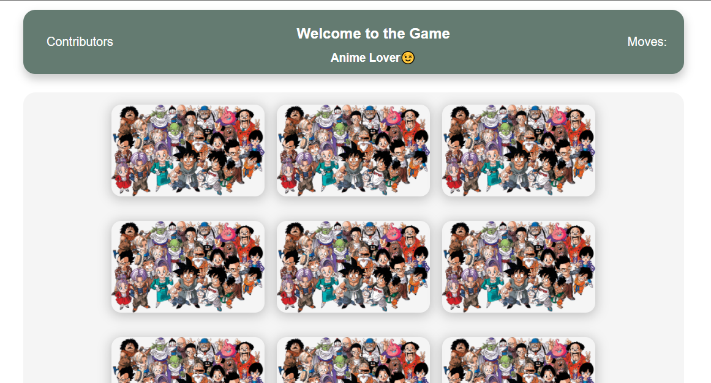

# Memory Game


### Hello Everyone 👋



This repo intends to make a fun memory game and provides the nubies with the opportunities to get their hands dirty.You can add anything you like in order to make it better. Also, to know about the making opensource contribution.

Read : [For Hacktoberfest 2021 Participants](CONTRIBUTING.md)

##### Live Project: [Click to play](https://game-memory-game.netlify.app)
##### Contribution Honour Page: [Click to Visit](https://game-memory-game.netlify.app/contributers-honourboard/contributors.html)
##### Game Referance Link: [Click to Visit](https://www.helpfulgames.com/subjects/brain-training/memory.html)


### How can you contribute?

- Fork/clone/create a branch of the repo.
- Make the changes.
- Commit the changes with poper message. You can also add a descriptive message about the feature/functionality (recommended).
- Create a pull request.
- Changes made to the code will be reviewed and merged if found in favour of the project.
- Add you info in the format mentioned below to get your name on 
  [Contribution Honour Page](https://game-memory-game.netlify.app/contributers-honourboard/contributors.html)
```{
    name: "Your Name Goes Here",
    gender: "Enter your gender",
    role: "what are you? a maintainer/contributor",
    img: "put your github profile pic link",
    twitter: "self explanatory, you know what to put here,right?",
    github: "self explanatory, you know what to put here,right?",
    linkedin: "self explanatory, you know what to put here,right?",
  },
  ```

